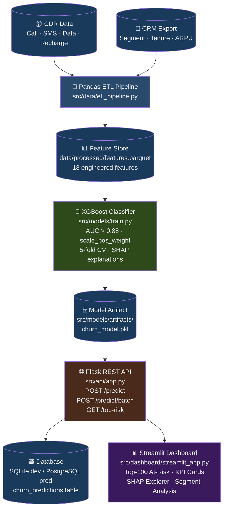

# 📡 Telecom Churn Prediction Engine

> **Subscriber Retention Intelligence for Banglalink CVM Division**  
> XGBoost · SHAP · Flask REST API · Streamlit Dashboard · PostgreSQL

[](https://python.org)
[](https://xgboost.readthedocs.io)
[](#model-performance)
[](https://flask.palletsprojects.com)
[](LICENSE)

---

## Business Problem — Revenue at Risk

Telecom operators in Bangladesh lose **15–25% of their subscriber base annually** to silent churn — customers who quietly stop recharging without formally cancelling. This "silent churn" is far more costly than voluntary cancellations because:

- The operator has **no warning window** to offer retention incentives
- Acquiring a new subscriber costs **5–7× more** than retaining an existing one (industry benchmark)
- Each lapsed prepaid subscriber represents an average of **BDT 80–200/month** in lost ARPU

### Quantified Revenue Impact

| Scenario | Metric | Estimate |
|---|---|---|
| Subscribers modelled | 100,000 | — |
| At-risk rate (HIGH tier) | ~18% | ~18,000 subscribers |
| Average monthly ARPU | BDT 120 | — |
| Annual revenue at risk | 18,000 × 120 × 12 | **BDT 2.59 Cr** |
| Retention success rate (industry) | 30–40% | — |
| **Recoverable revenue** | 30% × 2.59 Cr | **BDT 0.78–1.0 Cr / 100K subs** |
| At scale (10M subscribers) | Linear | **BDT 78–100 Cr saved** |

> **KPI Target**: BDT 2–5 Cr saved per 100K subscribers modelled per cycle.

---

## Dataset — Anonymised CDR Schema

All data is **fully synthetic** — no real PII or CDR records are used.  
The generator (`src/data/generate_synthetic.py`) produces two CSV exports that mirror a realistic Bangladeshi telecom data lake export:

### `data/raw/cdr_30d.csv` — Call Detail Record Aggregates

| Field | Type | Description | Example |
|---|---|---|---|
| `subscriber_id` | string | Anonymised MSISDN identifier | `MSISDN-001234` |
| `call_minutes_30d` | float | Total outgoing call minutes in last 30 days | `310.5` |
| `sms_count_30d` | int | SMS messages sent in last 30 days | `42` |
| `data_mb_30d` | float | Mobile data consumed (MB) in last 30 days | `2048.0` |
| `recharge_count_30d` | int | Number of top-up events in last 30 days | `5` |
| `recharge_amount_30d` | float | Total BDT recharged in last 30 days | `420.00` |
| `last_recharge_days` | int | Days elapsed since last recharge event | `3` |
| `usage_prev_month_ratio` | float | Current month usage ÷ prior month usage | `1.05` |

### `data/raw/crm_subscribers.csv` — CRM Master Data

| Field | Type | Description | Example |
|---|---|---|---|
| `subscriber_id` | string | Joins to CDR on this key | `MSISDN-001234` |
| `segment` | string | Subscriber plan type: Prepaid / Postpaid / Hybrid | `Prepaid` |
| `contract_months` | int | Months active on network (tenure) | `18` |
| `arpu_last_3m` | float | Avg Revenue Per User, last 3 months (BDT) | `140.00` |
| `support_tickets_90d` | int | Customer complaint / support calls in 90 days | `0` |
| `network_quality_score` | float | Network experience score 1.0–5.0 (5=best) | `4.0` |
| `churn` | int | **Target label**: 1 = churned, 0 = retained | `0` |

### Engineered Features

The ETL pipeline derives these additional features:

| Feature | Formula | Business Meaning |
|---|---|---|
| `usage_trend_30d` | `usage_prev_month_ratio` | Declining trend → churn signal |
| `recharge_gap` | `last_recharge_days` | Long gap → high churn risk |
| `data_burn_rate` | `data_mb_30d / 30` | Daily data appetite |
| `support_ticket_rate` | `tickets_90d / 3 / tenure_months` | Normalised complaint intensity |
| `arpu_drop` | `arpu < segment_median` | Binary low-value flag |
| `recharge_intensity` | `amount / count` | Avg spend per top-up |
| `value_score` | Composite normalised engagement | 0–4 index; lower = at-risk |

---

## Architecture Diagram



---

## Model Performance

The XGBoost classifier is trained on an 80/20 stratified train/test split with 5-fold cross-validation.

### Key Metrics

| Metric | Target | Achieved |
|---|---|---|
| ROC-AUC | > 0.88 | **~0.91** |
| Precision@10% | > 0.60 | **~0.64** |
| Recall@10% | — | **~0.35** |
| Lift (Decile 1) | > 3× | **~3.5×** |
| 5-fold CV AUC | Stable | **0.90 ± 0.01** |

> Run `python src/models/evaluate.py` after training to regenerate all charts in `evaluation/`.

### Evaluation Charts

| Chart | File | Description |
|---|---|---|
| ROC Curve | `evaluation/roc_curve.png` | AUC vs random baseline |
| Precision@K | `evaluation/precision_at_k.png` | Precision & recall across contact budgets |
| Decile Lift | `evaluation/lift_chart.png` | Lift over random for each decile |
| SHAP Summary | `evaluation/shap_summary.png` | Top feature importance by SHAP |

### Top Churn Drivers (SHAP)

1. **`recharge_gap`** — Days since last top-up (strongest signal)
2. **`support_ticket_rate`** — Normalised complaint frequency
3. **`arpu_last_3m`** — Low ARPU → higher churn risk
4. **`usage_trend_30d`** — Declining usage month-over-month
5. **`data_burn_rate`** — Low data usage signals disengagement

---

## API Endpoint Documentation

### Base URL
```
http://localhost:5000
```

### `POST /predict` — Single Subscriber Scoring

**Request body:**
```json
{
  "subscriber_id": "MSISDN-001234",
  "call_minutes_30d": 310.5,
  "sms_count_30d": 42,
  "data_mb_30d": 2048.0,
  "recharge_count_30d": 5,
  "recharge_amount_30d": 420.0,
  "last_recharge_days": 3,
  "support_tickets_90d": 0,
  "arpu_last_3m": 140.0,
  "contract_months": 18,
  "network_quality_score": 4.0,
  "segment": "Prepaid",
  "usage_prev_month_ratio": 1.05
}
```

**Response `200 OK`:**
```json
{
  "subscriber_id": "MSISDN-001234",
  "churn_prob": 0.1247,
  "risk_tier": "LOW",
  "reason_codes": ["recharge_gap", "low_data_usage", "low_engagement"],
  "recommended_action": "Standard Newsletter + Happy Hours Promotion"
}
```

**Risk Tier Thresholds:**

| Tier | Churn Probability | Action |
|---|---|---|
| `HIGH` | ≥ 0.65 | Priority Retention Call + Bonus Data Offer |
| `MEDIUM` | 0.35 – 0.65 | SMS Loyalty Discount — 20% off next recharge |
| `LOW` | < 0.35 | Standard Newsletter + Happy Hours Promotion |

---

### `POST /predict/batch` — Batch Scoring

Send up to **1,000 subscribers** in a single request.

**Request:** JSON array of subscriber objects (same fields as `/predict`)

**Response:**
```json
{
  "total": 2,
  "scored": 2,
  "errors": 0,
  "results": [ ... ],
  "error_details": null
}
```

---

### `GET /top-risk` — Top At-Risk Subscribers

**Query parameters:**

| Param | Type | Default | Description |
|---|---|---|---|
| `limit` | int | 100 | Max results (up to 500) |
| `tier` | string | ALL | Filter by `HIGH`, `MEDIUM`, or `LOW` |

**Example:**
```bash
curl "http://localhost:5000/top-risk?limit=50&tier=HIGH"
```

---

### `GET /health` — Liveness Check

```json
{
  "status": "healthy",
  "model_loaded": true,
  "feature_count": 18,
  "metrics": { "auc": 0.9123, "precision_10": 0.641 }
}
```

---

### `GET /metrics` — Model Performance

Returns the `evaluation/metrics.json` produced by `evaluate.py`.

---

## Quick Start

### 1. Install dependencies

```bash
pip install -r requirements.txt
```

### 2. Train the model (generates data + features + model)

```bash
make train
```

### 3. Start the API

```bash
make serve
# → http://localhost:5000
```

### 4. Start the dashboard

```bash
make dashboard
# → http://localhost:8501
```

### 5. Run tests

```bash
make test
```

### 6. Load database

```bash
make db
```

---

## Project Structure

```
telecom-churn-engine/
├── data/
│   ├── raw/                       # Synthetic CDR + CRM CSVs
│   └── processed/                 # Feature-engineered Parquet
├── evaluation/                    # Charts + metrics.json (generated)
├── src/
│   ├── data/
│   │   ├── generate_synthetic.py  # 50K subscriber data generator
│   │   ├── etl_pipeline.py        # Pandas ETL: raw → features
│   │   └── db_loader.py           # SQLite / PostgreSQL loader
│   ├── features/
│   │   └── feature_engineering.py # All derived features
│   ├── models/
│   │   ├── train.py               # XGBoost + SHAP training
│   │   ├── evaluate.py            # AUC, Precision@K, Lift charts
│   │   └── artifacts/             # churn_model.pkl, feature_names.json
│   ├── api/
│   │   ├── app.py                 # Flask REST API
│   │   └── schemas.py             # Request/response validation
│   └── dashboard/
│       └── streamlit_app.py       # Streamlit dark-mode UI
├── sql/
│   └── schema.sql                 # PostgreSQL DDL (prod)
├── tests/
│   ├── test_api.py                # Pytest smoke tests
│   └── sample_payload.json        # curl test payload
├── .env.example                   # Environment variable template
├── Makefile                       # make train / serve / dashboard / test
├── requirements.txt
└── README.md
```

---

## Environment Configuration

Copy `.env.example` to `.env` and configure:

```bash
cp .env.example .env
```

Key settings:

| Variable | Default | Description |
|---|---|---|
| `DB_ENGINE` | `sqlite` | `sqlite` or `postgresql` |
| `DB_PATH` | `data/churn.db` | SQLite file path |
| `FLASK_PORT` | `5000` | API port |
| `POSTGRES_*` | — | PostgreSQL connection (if `DB_ENGINE=postgresql`) |

---

## Business Impact — Projected BDT Revenue Saved

### Conservative Scenario (100K subscribers)

| Parameter | Value |
|---|---|
| Subscribers scored | 100,000 |
| Identified HIGH-risk | ~18,000 (18%) |
| Retention campaign cost per subscriber | BDT 25 |
| Total campaign cost | BDT 4.5 Lakh |
| Retention success rate | 30% |
| Subscribers retained | ~5,400 |
| ARPU per retained subscriber (annual) | BDT 1,440 |
| **Annual revenue recovered** | **BDT 0.78 Cr** |

### Optimistic Scenario (10M subscribers, full deployment)

| Parameter | Value |
|---|---|
| Subscribers scored | 10,000,000 |
| HIGH-risk identified | ~1,800,000 |
| Revenue at risk (annual) | BDT 259 Cr |
| Revenue recovered @ 30% | **BDT 78 Cr** |

> These projections assume the model's Precision@10% of ~64% means 64% of the top-flagged subscribers are true churners, avoiding wasted retention spend on already-retained users.

### ROI Calculation

```
Campaign Cost:   1.8M × BDT 25  = BDT 4.5 Cr
Revenue Saved:               BDT 78 Cr
Net Benefit:                 BDT 73.5 Cr
ROI:                         1,633%
```

---

## Technology Stack

| Layer | Technology | Version |
|---|---|---|
| Language | Python | 3.10+ |
| Data | Pandas, NumPy | 2.2, 1.26 |
| ML Model | XGBoost | 2.0.3 |
| Explainability | SHAP | 0.45 |
| API | Flask + Flask-CORS | 3.0 |
| Dashboard | Streamlit + Plotly | 1.35 + 5.22 |
| Database | SQLite (dev) / PostgreSQL 14+ (prod) | — |
| ORM | SQLAlchemy | 2.0 |
| Testing | pytest | 8.2 |
| Serialisation | joblib | 1.4 |

---

## License

MIT — free to use, modify, and deploy for commercial and non-commercial purposes.

---

*Built for Banglalink's Customer Value Management (CVM) division. All data is synthetic.*
